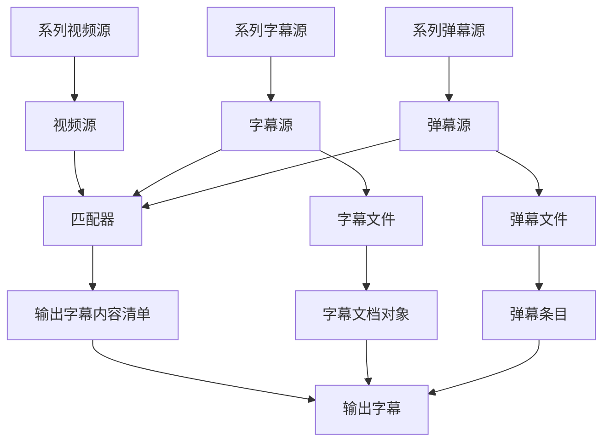

# MixSub

MixSub 是一个向字幕中混入多种数据源（如弹幕）的程序。支持自动下载匹配a站b站弹幕。

使用时需要输入本地视频存放的文件夹、b站视频页面（ss/ep/md）、弹幕文件区分于一般字幕文件的后缀，

会自动将对应集数的弹幕下载并转为ass格式，命名参照对应视频文件名。

支持使用本地弹幕的模式，可以用以前下载的弹幕修改转化字幕的风格，通过 `-r ''` 参数激活。

支持合并已有字幕，用字幕文件结尾tag或后缀标识，支持视频内字幕

支持修改默认弹幕格式

## 原理



## 用法

`bilidown.py [args...]`

```plaintext
bilidown.py [args]
Args:
	-l --local	本地视频路径
	-r --remote	b站视频页面/ID
	-t --tag	弹幕区分后缀
```

## 致谢

StarBrilliant [m13253](https://github.com/m13253) [弹幕格式转换程序](https://github.com/m13253/danmaku2ass)

[bilibili-API-collect](https://github.com/SocialSisterYi/bilibili-API-collect)

[acfun-danmakus](https://yleen.cc/archives/acfun-danmakus.html)
